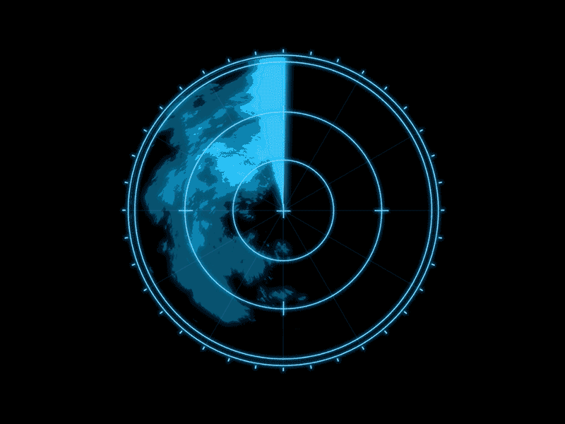

# school-projects-and-accessories
Repository for projects related to school work and other accessorial programs. Python, C++, Matlab. Purpose built calculators can be found in /calc. License is GNU General Public LIcense v3.0 unless otherwise stated, or if there are elements clearly borrowed from elsewhere.

